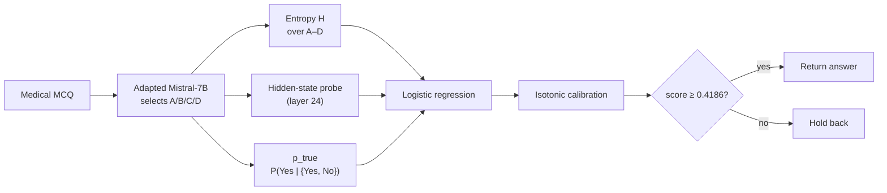

# Safe Enough to Answer Locally?
### Evaluating Uncertainty Routing in a Local Medical Language Model

**Oskar Kościański** · Bachelor's thesis · 2026


> **Scope.** This repository contains the code, recorded outputs and
> methodological audit for a single completed experiment on English medical
> multiple-choice exam questions. It makes **no claim of clinical safety** and
> is not intended for patient care.

---

## Abstract

Medical large language models (LLMs) perform strongly on question-answering
benchmarks, yet benchmark correctness alone does not establish clinical safety.
Local deployment, on an institutionally controlled machine, is attractive for
privacy and governance reasons, but a local model should not answer every
question. This thesis studies *uncertainty routing*: the local model returns an
answer only when a confidence score passes a cut-off, and otherwise holds it
back.

A Mistral-7B-Instruct-v0.3 model was adapted with LoRA on 102,765 MedMCQA
questions. Three uncertainty signals were extracted for each selected answer:
option entropy, a hidden-state correctness probe and `p_true` self-evaluation.
They were combined by logistic regression, calibrated with isotonic regression
and thresholded with a split-conformal procedure at α = 0.10. The system was
evaluated on 6,401 questions from MedMCQA validation, MedQA-USMLE and MMLU
medical.

**RQ1 (ranking).** The routing score ranks correct answers above wrong ones
better than chance on all three sets (AUROC 0.695–0.782; all 95% bootstrap
intervals above 0.50). Combining signals gave no consistent advantage over
entropy alone.

**RQ2 (reliability of acceptance).** The recorded protocol does not justify a
reliability claim for accepted answers. The 90% target controlled how often the
model answers, not how often it is correct: on MedMCQA, 79.3% of questions
were answered locally, but only 63.4% of those answers were correct, and 67% of
the model's errors were still returned. A post-hoc audit further shows that
calibration data had influenced feature selection, the scoring method changed
between calibration and evaluation, and the saved threshold fails a
same-sample consistency check.

*Useful ranking ≠ reliable local acceptance ≠ clinical safety.*

---

## Contents

1. [Research Questions](#1-research-questions)
2. [Method](#2-method)
3. [Data](#3-data)
4. [Results](#4-results)
5. [Methodological Audit](#5-methodological-audit)
6. [Limitations](#6-limitations)
7. [Conclusions and Future Work](#7-conclusions-and-future-work)
8. [Reproducibility](#8-reproducibility)
9. [Repository Structure](#9-repository-structure)
10. [Citation](#10-citation)
11. [Selected References](#11-selected-references)

---

## 1. Research Questions

A single confidence score serves two purposes that must be evaluated separately:
a useful ranking does not, by itself, justify an acceptance rule.

| | Question | Evidence |
|---|---|---|
| **RQ1** | Do correct answers receive higher confidence scores than wrong answers? | Ranking quality (AUROC) against the answer key |
| **RQ2** | Does the recorded protocol justify a reliability claim for the answers it accepts? | Calibration, scoring and thresholding audit; errors among accepted answers |

**Terminology.** Throughout this repository:

- **`local_rate`** = accepted / all: fraction of questions answered locally.
- **`local_accuracy`** = correct accepted / accepted: correctness among the
  answers that were returned.
- **Hold back** = withhold the local answer. No second responder (larger model
  or clinician) was evaluated.

---

## 2. Method



### 2.1 Model adaptation

| Setting | Value |
|---|---|
| Base model | `mistralai/Mistral-7B-Instruct-v0.3` |
| Adaptation | LoRA, bf16, SDPA attention |
| Learning rate | 5 × 10⁻⁵ |
| Training / early-stopping data | 102,765 / 2,000 questions |
| Best evaluation loss | 0.6366 (epoch 0.81) |
| Hardware | 4 × NVIDIA L4 (23.7 GB each) |

### 2.2 Uncertainty signals

1. **Entropy over A/B/C/D** (Shannon, 1948). Low entropy means one option
   dominates the restricted answer distribution.
2. **Hidden-state correctness probe** (Alain & Bengio, 2018; Hewitt & Liang,
   2019). A small classifier trained on internal activations to predict
   whether the selected answer is correct. Layer 24 was selected by a
   supervised layer sweep.
3. **`p_true` self-evaluation** (Kadavath et al., 2022). The model is asked
   whether its answer is correct; the signal is the conditional probability
   P(Yes | {Yes, No}).

A fourth signal, the top-two logit gap, was dropped because of its strong
correlation with entropy (|r| = 0.956).

### 2.3 Router and threshold

The three signals are combined by logistic regression and mapped to an
estimated probability of correctness by isotonic regression (cf. Guo et al.,
2017). A split-conformal step at α = 0.10, targeting a 90% local-answer rate,
produced q̂ = 0.5814, i.e. the decision rule *return if score ≥ 0.4186*.
This is an instance of selective prediction with a reject option (Chow, 1970;
El-Yaniv & Wiener, 2010).

---

## 3. Data

Task: choose one answer (A–D) and compare it with the answer key.

```text
DEVELOPMENT  (MedMCQA train, single-answer items: 120,765)
  ├── model adaptation pool: 104,765
  │     ├── fine-tuning: 102,765
  │     └── early stopping: 2,000
  └── routing candidates: 16,000
        ├── removed (normalised exact match to training data): 2,693
        └── retained: 13,307
              ├── fit router (routing_train):        8,000
              ├── calibrate probabilities (iso_cal): 2,000
              └── choose cut-off (conformal_cal):    3,307

EVALUATION  (6,401 questions)
  ├── MedMCQA validation:  4,183   nominal in-distribution
  ├── MedQA-USMLE test:    1,273   external
  └── MMLU medical:          945   external
```

The MedMCQA test split has hidden labels and was not usable for labelled
evaluation. A post-run overlap check found 1 of 4,183 validation questions with
a normalised exact match in the training pool and none in the routing data.

---

## 4. Results

All values are point estimates from the recorded run (`results/evaluation.json`);
intervals are 95% bootstrap (AUROC) or Wilson (proportions,
`audited/results/operating_point_intervals.md`).

### 4.1 RQ1 — Ranking quality

| Evaluation set | n | Accuracy | AUROC [95% CI] | AUGRC | Brier | ECE |
|---|---:|---:|---|---:|---:|---:|
| MedMCQA val | 4,183 | 0.569 | **0.743** [0.729, 0.757] | 0.156 | 0.204 | 0.055 |
| MedQA-USMLE | 1,273 | 0.566 | **0.695** [0.667, 0.721] | 0.169 | 0.230 | 0.103 |
| MMLU medical | 945 | 0.686 | **0.782** [0.753, 0.811] | 0.095 | 0.171 | 0.043 |

AUROC is the probability that a randomly chosen correct answer receives a
higher score than a randomly chosen wrong one (0.50 = chance).

**Signal ablation (AUROC, refitted subsets).**

| Features | MedMCQA | MedQA-USMLE | MMLU medical |
|---|---:|---:|---:|
| H | 0.743 | 0.698 | 0.782 |
| probe | 0.722 | 0.681 | 0.768 |
| p_true | 0.593 | 0.575 | 0.621 |
| H + probe | 0.742 | 0.695 | 0.782 |
| H + probe + p_true | 0.741 | 0.695 | 0.783 |

Combining signals did not consistently improve on entropy alone.

### 4.2 RQ2 — What the acceptance rule returns

| Evaluation set | Answered locally | `local_rate` [95% CI] | Correct among returned | `local_accuracy` [95% CI] |
|---|---:|---|---:|---|
| MedMCQA val | 3,316 / 4,183 | 0.793 [0.780, 0.805] | 2,102 / 3,316 | 0.634 [0.617, 0.650] |
| MedQA-USMLE | 1,154 / 1,273 | 0.907 [0.889, 0.921] | 673 / 1,154 | 0.583 [0.555, 0.611] |
| MMLU medical | 870 / 945 | 0.921 [0.902, 0.936] | 624 / 870 | 0.717 [0.686, 0.746] |

**90% selection is not 90% correctness.** The target concerned how often to
answer; it did not control error risk.

### 4.3 RQ2 — Which errors were held back?

| Evaluation set | Model errors | Returned anyway | Held back | Share held back |
|---|---:|---:|---:|---:|
| MedMCQA val | 1,804 | 1,214 | 590 | 33% |
| MedQA-USMLE | 552 | 481 | 71 | 13% |
| MMLU medical | 297 | 246 | 51 | 17% |

Most wrong answers still passed the cut-off. Holding an answer back was
measured; whether anything downstream corrected it was not.

---

## 5. Methodological Audit

The audit is a secondary, CPU-only analysis of recorded outputs, not a model
rerun. It identifies why the recorded procedure cannot support a formal
reliability claim, even one restricted to `local_rate`:

| # | Issue | Consequence |
|---|---|---|
| A1 | The conformal target is the local-answer frequency, not correctness or error risk. | No guarantee on `local_accuracy`. |
| A2 | 483 of the 2,000 examples used to select the probe layer later belong to `conformal_cal`. | Threshold data had influenced feature selection. |
| A3 | Out-of-fold probe scores were built on the full routing pool before its outcome-stratified partition. | Calibration subset was not untouched. |
| A4 | Calibration used out-of-fold probe scores; evaluation used a probe refit on the full pool. | Score construction changed between stages. |
| A5 | On its own calibration set the saved threshold selects 2,944 / 3,307; the quantile boundary requires ≥ 2,978. | Execution-level invariant failure. |
| A6 | The recorded `p_true` vocabulary-mass check summed a two-token softmax (`mass = 1.0` by construction). | Check is tautological, not evidence of signal quality. |

A different cut-off alone would not resolve A1–A4. The full analysis is in
[`REPORT.md`](REPORT.md); interpretation decisions are logged in
[`decisions.md`](decisions.md).

---

## 6. Limitations

- **Task scope.** English medical multiple-choice exam questions; results do
  not transfer to free-text clinical dialogue or patient care.
- **Single run.** One model, one adaptation, one seed; no variance across runs.
- **No downstream responder.** Held-back questions were not routed to, or
  answered by, any second system or clinician.
- **No replay.** Model checkpoints and feature arrays are not included, so
  corrected routing or conformal analyses cannot be recomputed from this
  repository (see [`PROVENANCE.md`](PROVENANCE.md)).
- **External sets.** Higher MMLU performance may reflect pretraining
  familiarity; this is a hypothesis, not a tested finding.
- **Historical subgroup analysis.** The recorded Mondrian (per-domain) analysis
  used an incomplete subject mapping and is not a corrected result.

---

## 7. Conclusions and Future Work

**RQ1.** The routing score ranks correct answers above wrong ones on all three
evaluation sets; additional signals show no consistent advantage over entropy.

**RQ2.** The recorded protocol does not justify reliable local acceptance: the
90% target concerned selection rather than correctness, calibration data were
reused, scoring changed between stages, and a threshold check failed.

Before relying on such a system, a follow-up study should:

1. define the acceptable error rate among returned answers (risk control rather
   than coverage control);
2. freeze the scoring method and use disjoint data for probability calibration,
   risk calibration and final testing;
3. report `local_rate`, `local_accuracy` and error capture separately;
4. evaluate the next responder and the clinical workflow after an answer is
   held back (cf. DECIDE-AI; Vasey et al., 2022).

These are proposed next steps, not outcomes demonstrated by this thesis.

---

## 8. Reproducibility

The GPU pipeline (`scripts/00`–`09`) has already been executed and is
write-guarded; raw outputs are immutable and hash-anchored. Verification is
read-only and runs on CPU:

```bash
pip install pytest numpy matplotlib pyyaml   # audit-only dependencies (no GPU stack needed)
make verify-evidence   # check raw + audited artifact hashes and cross-file consistency
pytest -q              # repository audit tests
```

Optional CPU-only regeneration of the audit layer writes to a separate
directory and never overwrites committed evidence:

```bash
make audit
make audit-overlap
```

| Provenance item | Location |
|---|---|
| Executed protocol values | [`configs/executed_run.yaml`](configs/executed_run.yaml) |
| Exact executed source (baseline commit `a34323d`) | `artifacts/run/executed_source.tar.gz` |
| Original execution report | `artifacts/run/REPORT_ORIGINAL.md` |
| Raw artifact hashes | `artifacts/run/raw_artifacts.sha256` |
| MedMCQA revision used by overlap audit | `91c6572c454088bf71b679ad90aa8dffcd0d5868` |

Other configs in `configs/` contain superseded planning values.

---

## 9. Repository Structure

```text
.
├── REPORT.md                 audited final report (canonical)
├── PROVENANCE.md             artifact boundary and replay limitations
├── decisions.md              interpretation decision log
├── roadmap.md                completed-run roadmap
├── configs/
│   └── executed_run.yaml     executed protocol manifest
├── scripts/
│   ├── 00–09_*.py            recorded GPU pipeline (write-guarded)
│   ├── 10_audit_recorded_results.py
│   └── 11_audit_validation_overlap.py
├── src/thesis/               shared library code
├── data/splits/              committed split indices
├── results/                  recorded JSON outputs        (immutable)
├── figures/                  recorded figures             (immutable)
├── logs/                     execution logs               (immutable)
├── audited/                  derived CPU-only audit outputs
├── artifacts/
│   ├── run/                  original report, source archive, hashes
│   └── audited_layer/        audit-layer hashes
└── tests/                    audit tests
```

Raw figures are historical; consult
`audited/results/figure_usage_catalog.md` before reusing one, and
`audited/results/raw_artifact_errata.md` for known corrections. Raw split
labels `in-dist`, `near-OOD` and `far-OOD` correspond to MedMCQA validation,
external MedQA-USMLE and external MMLU medical.

---

## 10. Citation

```bibtex
@thesis{koscianski2026safe,
  author = {Kościański, Oskar},
  title  = {Safe Enough to Answer Locally? Evaluating Uncertainty Routing
            in a Local Medical Language Model},
  type   = {Bachelor's thesis},
  year   = {2026}
}
```

---

## 11. Selected References

The full bibliography is in the thesis.

- Alain, G., & Bengio, Y. (2018). Understanding intermediate layers using linear classifier probes. *arXiv:1610.01644*.
- Chow, C. K. (1970). On optimum recognition error and reject tradeoff. *IEEE Transactions on Information Theory*, 16(1), 41–46.
- El-Yaniv, R., & Wiener, Y. (2010). On the foundations of noise-free selective classification. *Journal of Machine Learning Research*, 11, 1605–1641.
- Guo, C., Pleiss, G., Sun, Y., & Weinberger, K. Q. (2017). On calibration of modern neural networks. *ICML*.
- Hewitt, J., & Liang, P. (2019). Designing and interpreting probes with control tasks. *EMNLP-IJCNLP*.
- Kadavath, S., et al. (2022). Language models (mostly) know what they know. *arXiv:2207.05221*.
- Shannon, C. E. (1948). A mathematical theory of communication. *Bell System Technical Journal*, 27, 379–423.
- Singhal, K., et al. (2023). Large language models encode clinical knowledge. *Nature*, 620, 172–180.
- Vasey, B., et al. (2022). Reporting guideline for the early-stage clinical evaluation of decision support systems driven by artificial intelligence: DECIDE-AI. *Nature Medicine*, 28, 924–933.
